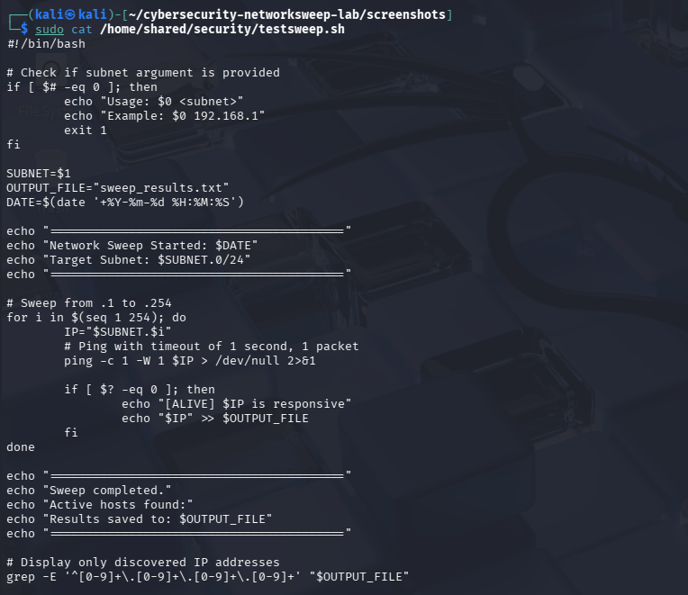
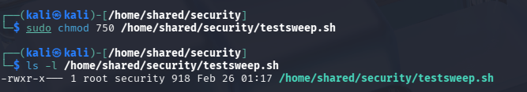
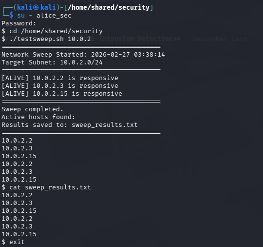

it# Cybersecurity Network Sweep Lab

---

## :lock: Lab Title
**Network Device Sweep & Intrusion Detection** - SecureNet Corp

---

## :dart: Objective
Develop a secure network sweep lab to detect unauthorized devices following a BYOD (Bring Your Own Device) Policy breach. The solution includes:
- Restricted access control via Linux security groups
- Automated ping sweep functionality
- Secure logging of network inventory

## :hammer_and_wrench: Tools Used
- **Operating System:** Kali Linux
- **Shell:** Bash scripting
- **Networking:** ICMP/ping utilities
- **Access Control:** Linux Groups & File Permissions (chmod/chown)

---

## :clipboard: Step-by-Step Process

### Phase 1: Security Group Configuration
1. Create a dedicated group for authorized personnel: `security`.
2. Add three users to the group: `alice_sec`, `bob_sec`, `carol_sec`.
3. Verify group and user membership using `getent group security`


### Phase 2: Script Development
1. Create the network sweep script `testsweep.sh` under `/home/shared/security`.
2. Implement a subnet-based ping sweep (e.g., hosts  1-254).
3. Include error handling and usage instructions within the script.
4. Configure logging with timestamps to `sweep_results.txt`.



### Phase 3: Access Control
1. Set group ownership of the script to `security`.
2. Apply secure permissions (750) to restrict execution to group members.
3. Verify that non-members cannot execute the script



### Phase 4: Testing & Validation
1. Execute the sweep on a test subnet: `./testsweep.sh 10.0.2`.
2. Confirm detection of active hosts.
3. Ensure log file `sweep_results.txt` is generated and populated correctly.



---

## :desktop_computer: Commands Executed

### Group and User Creation
```bash
sudo groupadd security
sudo useradd -m -G security alice_sec
sudo useradd -m -G security bob_sec
sudo useradd -m -G security carol_sec
```

### Permission Setup
```bash
sudo chown root:security /home/shared/security/testsweep.sh
sudo chmod 750 /home/shared/security/testsweep.sh
```

### Script Execution
```bash
./testsweep.sh 10.0.2
```

---

‎## :mag: Key Observations/Lessons Learned
1. ‎**Defense in Depth:** Combining group-based access control with file permissions creates multiple layers of security.
2. ‎**Automation Benefits:** Scripted sweeps reduce human error and provide consistent, repeatable results.
3. ‎**Logging Importance:** Timestamped records enable forensic analysis and trend detection.
4. ‎**Least Privilege:** Restricting execution to security team members prevents unauthorized reconnaissance.
5. ‎**BYOD Risks:** The lab highlighted the critical need for detecting unauthorized devices to maintain network security.
